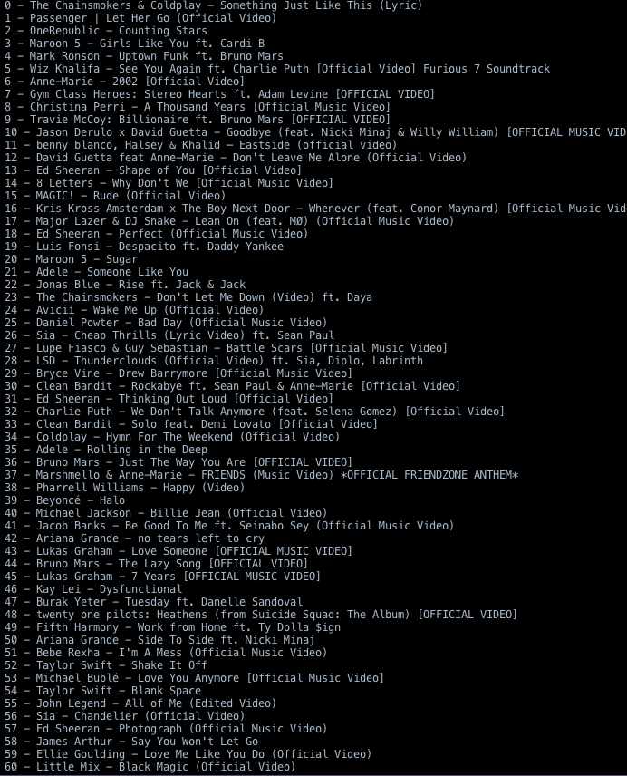

# YoutubePlaylistVideoTitle
This Program copy's all video titles of a youtube playlist. 
This is important because sometimes youtube deletes music titles and so you can not see which video exactly got deleted. 

With this Python Programm u can save all video titles and if one gets deleted watch in ur list which one it was...

To use this software you must go to https://console.developers.google.com/project and create a new project.
Then you will have to go to the API Keys section and create a new youtube Data API v3 key.

This key you will have to insert into the properly section into the index.py.

Then you are able to use the program and you will get the videos promped into the terminal in which you're using python.

Restrictions:
This Software runs only in Python3.
If the playlist contains deleted videos it will abort when it reaches such a video. You will have to save the playlist into your account and the manually delete those videos.

Greets by Daniel Oberlechner

Feel free to copy, extend or write changes to this code.

Here a Example from a random Music Playlist I created:

