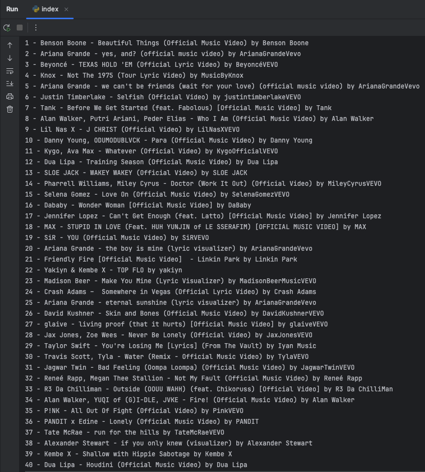

# YoutubePlaylistVideoTitle
This Program is able to copy all video titles of multiple youtube playlists. 
This is important because sometimes youtube deletes music titles or a user sets a video as private and so you can not see which video exactly is missing in your playlist.

This short script saves all video names from multiple playlists into a directory and creates another with the current date.

If a video from your playlist gets deleted you can use the created files to lookup which one it was and then search for the same video from a different uploader and add it again to your music playlist.

## Requirements
First you'll need a Google Account and then go to https://console.developers.google.com/project and create a new project.
Then go to the API Keys section and create a new Youtube Data API v3 key. All of this is of course free.

Insert this key into the index.py and search for the 'apiKey' variable which is on the top of the script.
Then you need your playlist url which should be looking like the one below: <br />
https://www.youtube.com/watch?v=SlPhMPnQ58k&list=PLx0sYbCqOb8TBPRdmBHs5Iftvv9TPboYG

What is important is the string after 'list=', so in this case the pure playlist ID would be the following:
PLx0sYbCqOb8TBPRdmBHs5Iftvv9TPboYG

Lets make a clear example: <br />
You have two playlists: <br />
1x Music Playlist <br />
1x Random Playlist <br />

Now go to "Playlists Examples" in the index.py file. <br />
Create the following variables like this: <br />
```python
Music = ["Playlist_ID", "Music"]
Random = ["Playlist_ID", "Random"]

allPlaylists = [Music, Random]
```

Now you have chosen the directory name to be "Music" and "Random". <br />
Now you're able to run the script! :)

### Restrictions:
This Software needs Python3 to run and the Python module "requests". <br />
You can install dependencies like this: <br /><br />
pipenv install <br /> or else<br /> pip3 install requests

### Good to know!
If a video is deleted in your playlist, it will be shown as "Index Number - Deleted Video".

If you have a public playlist for example from youtube directly or for example from a friend you first have to save the playlist into your own account or else you can't download it. <br />

It would quit the script saying: <br />
`404 Playlist was not found`

For questions or comments you can create a issue or reach me here: <br />
https://github.com/DanielOberlechner/YoutubePlaylistVideoTitle/issues <br />
https://twitter.com/danielthehok

Greets by 
Daniel Oberlechner! :)

Below you can see an example output: <br />

